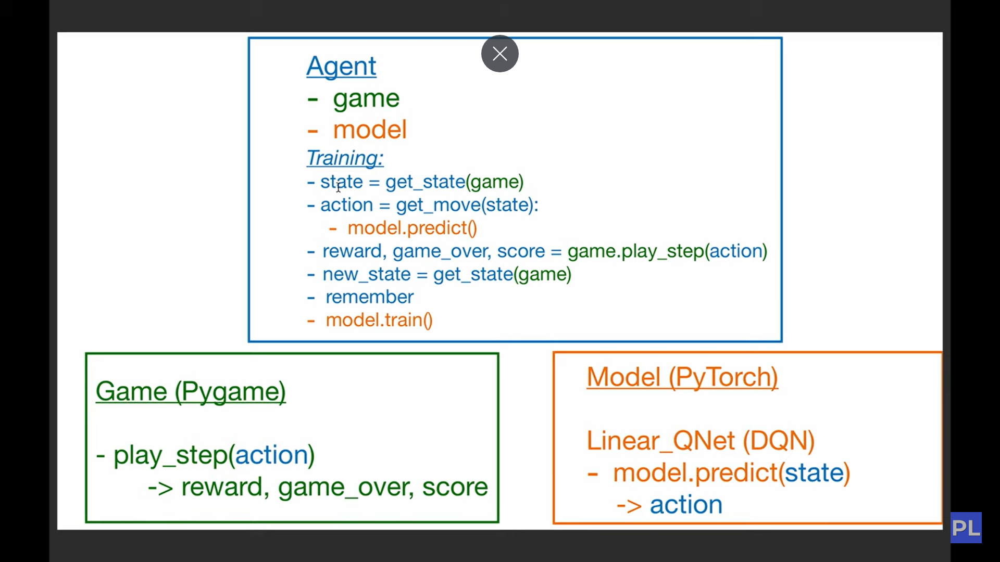
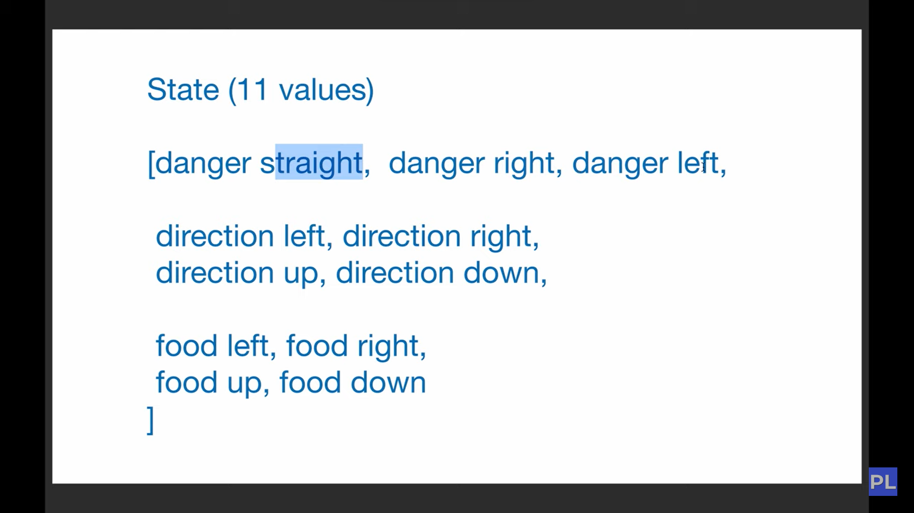
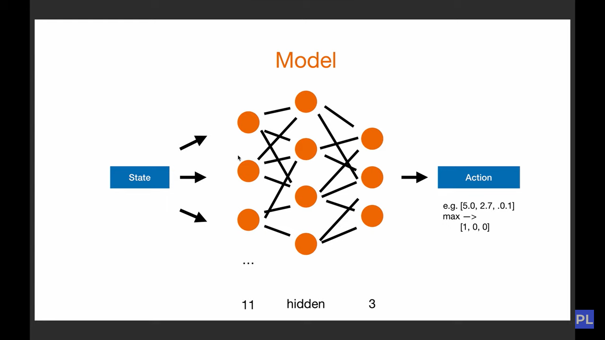
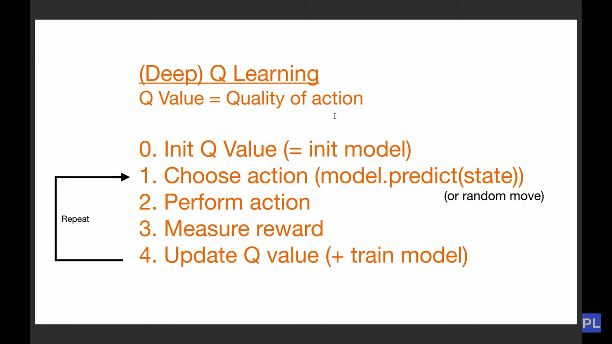
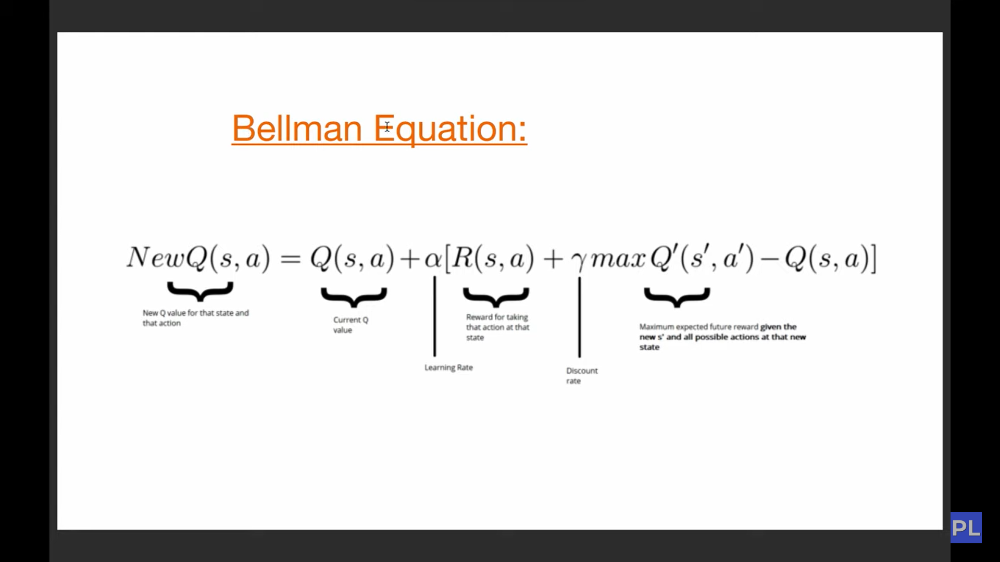

# AI Snake: Reinforcement Learning with PyTorch and Pygame

## Overview

Welcome to the AI Snake project, a reinforcement learning endeavor that trains software agents to play the classic Snake game. Reinforcement learning focuses on guiding agents to take actions in an environment to maximize cumulative rewards. In simpler terms, it involves teaching an agent to behave effectively by evaluating its performance based on the concept of rewards.

## Reinforcement Learning

In the context of this project, reinforcement learning teaches our software agent how to navigate the Snake game environment by assessing its performance. The goal is to guide the agent to make decisions that lead to maximizing its cumulative rewards.

## Project Structure

The project includes the following components:

- **Snake Game Environment:** Modeled using Pygame, providing a visually interactive platform for the AI agent to navigate.

## Images

## Bellman Equation

The project incorporates the Bellman Equation, a key concept in reinforcement learning. This equation plays a crucial role in evaluating the expected rewards and shaping the agent's decision-making process.

## Model Training

During the training phase, the neural network refines its predictions based on the Bellman Equation and the agent's experiences in the Snake game environment.

## Contributions

Contributions to the project are welcome! Feel free to explore, suggest enhancements, or submit pull requests.
## Reference

This project was created with reference to  [YouTube](https://www.youtube.com/watch?v=PJl4iabBEz0&list=PLqnslRFeH2UrDh7vUmJ60YrmWd64mTTKV&index=2).

Thank you for being part of the AI Snake project! Happy coding! 🐍🤖