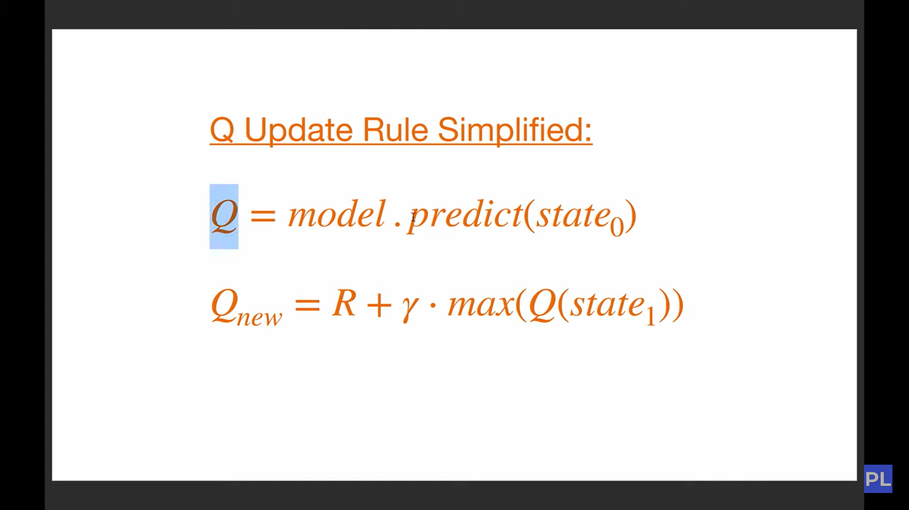

# Teach AI To Play Snake! Reinforcement Learning With PyTorch and Pygame

### Reinforcement Learning  is an area  of machine learning concerned with how software agents ought  to take actions is an environment  in order  to maximize the notion of cumulative reward 
 #### or 
 ### RL is teaching a software  agent how to behave in an environment by telling  it how good it's doing

 ##  Deep learning 
 ### This approach extends reinforcement learning by using a deep neural network to predict the actions

 
 
 
 

 ## Bellman Equation
 
 
